# Terraform - AWS API + Lambda

[Back](../../README.md)

- [Terraform - AWS API + Lambda](#terraform---aws-api--lambda)
  - [Overview](#overview)
  - [API Gateway](#api-gateway)
    - [Create API Gateway](#create-api-gateway)
    - [Create a Mock POST](#create-a-mock-post)
    - [Deploy stage](#deploy-stage)
  - [Lambda](#lambda)
    - [Lambda Function - Node.js](#lambda-function---nodejs)
    - [Create an AWS Lambda function](#create-an-aws-lambda-function)
    - [Define IAM role](#define-iam-role)
    - [Define lambda function](#define-lambda-function)
    - [Integrate Lambda function with API Gateway](#integrate-lambda-function-with-api-gateway)
    - [Add policy](#add-policy)
    - [Test](#test)
    - [Enable the CORS](#enable-the-cors)
    - [Test the deployment using Postman](#test-the-deployment-using-postman)
  - [AWS Cognito](#aws-cognito)
    - [create a user pool client](#create-a-user-pool-client)
    - [Use Cognito Authorizer in API Gateway for authentication](#use-cognito-authorizer-in-api-gateway-for-authentication)
    - [Test using Postman](#test-using-postman)
    - [Generate authentication token from Cognito and access the API](#generate-authentication-token-from-cognito-and-access-the-api)

---

## Overview

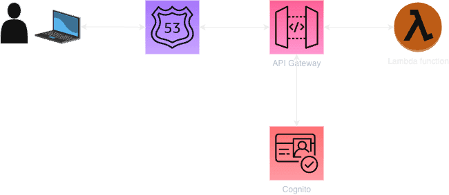

## API Gateway

### Create API Gateway

```hcl
# Create API Gateway
resource "aws_api_gateway_rest_api" "my_api" {
  name        = "my-api"
  description = "My API Gateway"

  endpoint_configuration {
    types = ["REGIONAL"]
  }
}

# adding a root resource: <URL>/mypath
resource "aws_api_gateway_resource" "root" {
  rest_api_id = aws_api_gateway_rest_api.my_api.id
  parent_id   = aws_api_gateway_rest_api.my_api.root_resource_id
  path_part   = "mypath"
}
```

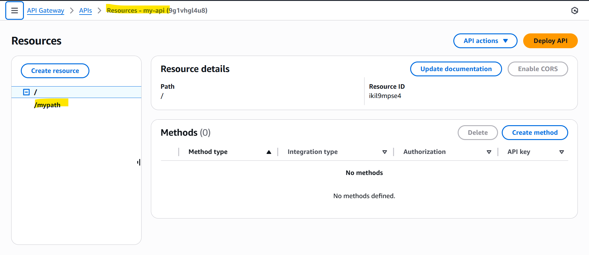

---

### Create a Mock POST

- It defines a POST request and response.
  - Mock will be updated by a Lambda later.

```hcl
# add POST methods
resource "aws_api_gateway_method" "proxy" {
  rest_api_id   = aws_api_gateway_rest_api.my_api.id
  resource_id   = aws_api_gateway_resource.root.id
  http_method   = "POST"
  authorization = "NONE"
}

resource "aws_api_gateway_integration" "lambda_integration" {
  rest_api_id             = aws_api_gateway_rest_api.my_api.id
  resource_id             = aws_api_gateway_resource.root.id
  http_method             = aws_api_gateway_method.proxy.http_method
  integration_http_method = "POST"
  type                    = "MOCK"
}

resource "aws_api_gateway_method_response" "proxy" {
  rest_api_id = aws_api_gateway_rest_api.my_api.id
  resource_id = aws_api_gateway_resource.root.id
  http_method = aws_api_gateway_method.proxy.http_method
  status_code = "200"
}

resource "aws_api_gateway_integration_response" "proxy" {
  rest_api_id = aws_api_gateway_rest_api.my_api.id
  resource_id = aws_api_gateway_resource.root.id
  http_method = aws_api_gateway_method.proxy.http_method
  status_code = aws_api_gateway_method_response.proxy.status_code

  depends_on = [
    aws_api_gateway_method.proxy,
    aws_api_gateway_integration.lambda_integration
  ]
}
```

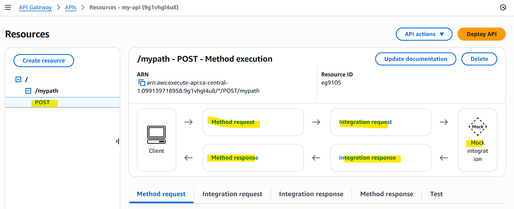

---

### Deploy stage

```hcl

# deploy stage
resource "aws_api_gateway_deployment" "deployment" {
  depends_on = [
    aws_api_gateway_integration.lambda_integration,
    aws_api_gateway_integration.options_integration,
  ]

  rest_api_id = aws_api_gateway_rest_api.my_api.id

  # trigger
  triggers = {
    redeployment = sha1(jsonencode([
      aws_api_gateway_resource.root.id,
      aws_api_gateway_method.proxy.id,
      aws_api_gateway_method.options.id,
      aws_api_gateway_integration.lambda_integration.id,
      aws_api_gateway_integration.options_integration.id,
    ]))
  }

  lifecycle {
    create_before_destroy = true
  }
}

resource "aws_api_gateway_stage" "dev" {
  deployment_id = aws_api_gateway_deployment.deployment.id
  rest_api_id   = aws_api_gateway_rest_api.my_api.id
  stage_name    = "dev"
}
```

---

## Lambda

### Lambda Function - Node.js

- index.js

```js
exports.handler = async (event) => {
  const response = {
    statusCode: 200,
    headers: {
      "Content-Type": "application/json",
    },
    body: JSON.stringify({
      message: "Hello from Lambda!",
    }),
  };

  return response;
};
```

---

### Create an AWS Lambda function

- data source - the nodejs function

```hcl
data "archive_file" "lambda_package" {
  type = "zip"
  source_file = "index.js"
  output_path = "index.zip"
}
```

---

### Define IAM role

```hcl
# define lambda role
resource "aws_iam_role" "lambda_role" {
  name = "lambda-role"

  assume_role_policy = jsonencode({
    Version = "2012-10-17",
    Statement = [
      {
        Action = "sts:AssumeRole",
        Effect = "Allow",
        Principal = {
          Service = "lambda.amazonaws.com"
        }
      }
    ]
  })
}
```

### Define lambda function

```hcl
# define lambda function
resource "aws_lambda_function" "html_lambda" {
  filename         = "index.zip"
  function_name    = "myLambdaFunction"
  role             = aws_iam_role.lambda_role.arn
  handler          = "index.handler"
  runtime          = "nodejs22.x"
  source_code_hash = data.archive_file.lambda_package.output_base64sha256
}
```

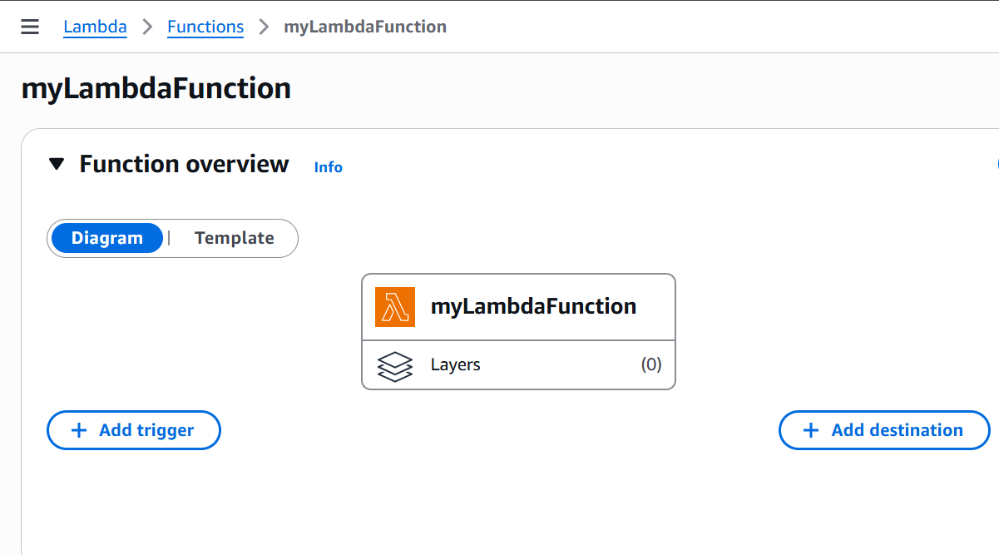

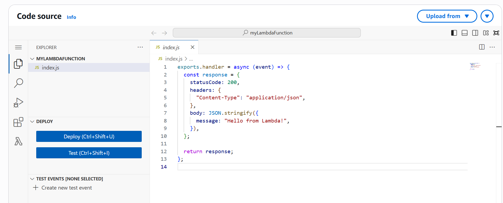

---

### Integrate Lambda function with API Gateway

- replace the type from MOCK to AWS Lambda
- updated apigateway.tf

```hcl
resource "aws_api_gateway_integration" "lambda_integration" {
  rest_api_id = aws_api_gateway_rest_api.my_api.id
  resource_id = aws_api_gateway_resource.root.id
  http_method = aws_api_gateway_method.proxy.http_method
  integration_http_method = "POST"
  type = "AWS"
  uri = aws_lambda_function.html_lambda.invoke_arn
}
```

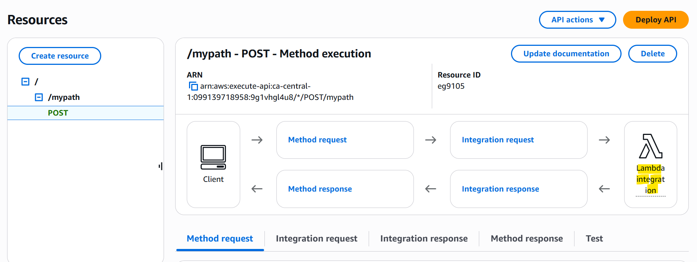

---

### Add policy

```hcl
# Attach basic execution policy to role
resource "aws_iam_role_policy_attachment" "lambda_basic" {
  policy_arn = "arn:aws:iam::aws:policy/service-role/AWSLambdaBasicExecutionRole"
  role       = aws_iam_role.lambda_role.name
}

# Grant API Gateway permission to invoke Lambda
resource "aws_lambda_permission" "apigw_lambda" {
  statement_id  = "AllowExecutionFromAPIGateway"
  action        = "lambda:InvokeFunction"
  function_name = aws_lambda_function.html_lambda.function_name
  principal     = "apigateway.amazonaws.com"

  # FIXED: More specific source ARN pattern
  source_arn = "${aws_api_gateway_rest_api.my_api.execution_arn}/*/*"
}
```

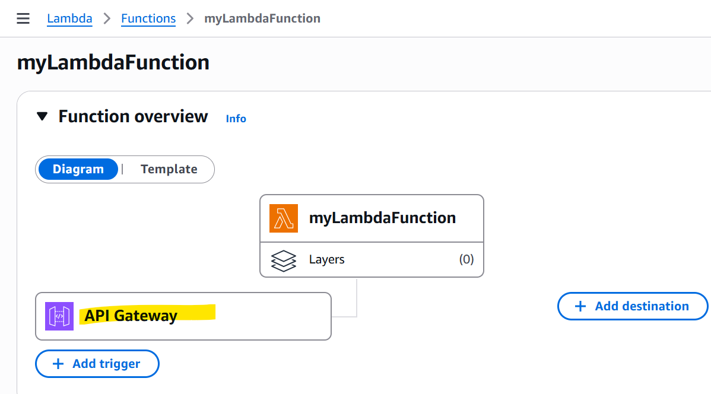

---

### Test

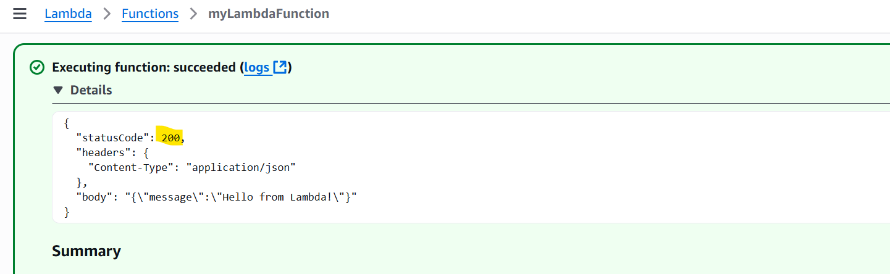

---

### Enable the CORS

- update the method and integration response
- `apigateway.tf`

```hcl
# Add option method for CROS
resource "aws_api_gateway_method" "options" {
  rest_api_id   = aws_api_gateway_rest_api.my_api.id
  resource_id   = aws_api_gateway_resource.root.id
  http_method   = "OPTIONS"
  authorization = "NONE"

  # authorization = "COGNITO_USER_POOLS"
  # authorizer_id = aws_api_gateway_authorizer.demo.id
}

resource "aws_api_gateway_integration" "options_integration" {
  rest_api_id             = aws_api_gateway_rest_api.my_api.id
  resource_id             = aws_api_gateway_resource.root.id
  http_method             = aws_api_gateway_method.options.http_method
  integration_http_method = "OPTIONS"
  type                    = "MOCK"
  request_templates = {
    "application/json" = "{\"statusCode\": 200}"
  }
}

resource "aws_api_gateway_method_response" "options_response" {
  rest_api_id = aws_api_gateway_rest_api.my_api.id
  resource_id = aws_api_gateway_resource.root.id
  http_method = aws_api_gateway_method.options.http_method
  status_code = "200"

  response_parameters = {
    "method.response.header.Access-Control-Allow-Headers" = true,
    "method.response.header.Access-Control-Allow-Methods" = true,
    "method.response.header.Access-Control-Allow-Origin"  = true
  }
}

resource "aws_api_gateway_integration_response" "options_integration_response" {
  rest_api_id = aws_api_gateway_rest_api.my_api.id
  resource_id = aws_api_gateway_resource.root.id
  http_method = aws_api_gateway_method.options.http_method
  status_code = aws_api_gateway_method_response.options_response.status_code

  response_parameters = {
    "method.response.header.Access-Control-Allow-Headers" = "'Content-Type,X-Amz-Date,Authorization,X-Api-Key,X-Amz-Security-Token'",
    "method.response.header.Access-Control-Allow-Methods" = "'GET,OPTIONS,POST,PUT'",
    "method.response.header.Access-Control-Allow-Origin"  = "'*'"
  }

  depends_on = [
    aws_api_gateway_method.options,
    aws_api_gateway_integration.options_integration,
  ]
}

# update method response
resource "aws_api_gateway_method_response" "proxy" {
  rest_api_id = aws_api_gateway_rest_api.my_api.id
  resource_id = aws_api_gateway_resource.root.id
  http_method = aws_api_gateway_method.proxy.http_method
  status_code = "200"

  //cors section
  response_parameters = {
    "method.response.header.Access-Control-Allow-Headers" = true,
    "method.response.header.Access-Control-Allow-Methods" = true,
    "method.response.header.Access-Control-Allow-Origin"  = true
  }
}

# update integration response
resource "aws_api_gateway_integration_response" "proxy" {
  rest_api_id = aws_api_gateway_rest_api.my_api.id
  resource_id = aws_api_gateway_resource.root.id
  http_method = aws_api_gateway_method.proxy.http_method
  status_code = aws_api_gateway_method_response.proxy.status_code
  //cors
  response_parameters = {
    "method.response.header.Access-Control-Allow-Headers" = "'Content-Type,X-Amz-Date,Authorization,X-Api-Key,X-Amz-Security-Token'",
    "method.response.header.Access-Control-Allow-Methods" = "'GET,OPTIONS,POST,PUT'",
    "method.response.header.Access-Control-Allow-Origin"  = "'*'"
  }

  depends_on = [
    aws_api_gateway_method.proxy,
    aws_api_gateway_integration.lambda_integration
  ]
}
```

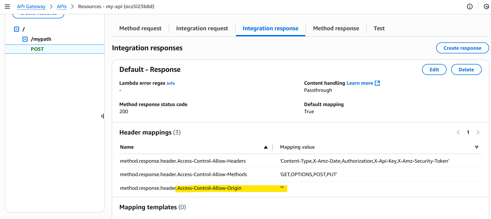

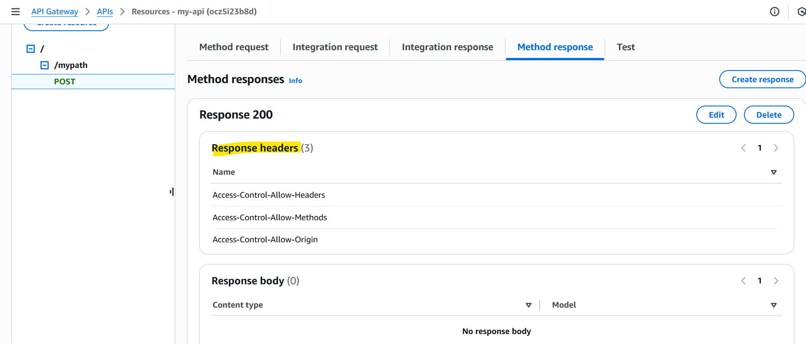

---

### Test the deployment using Postman

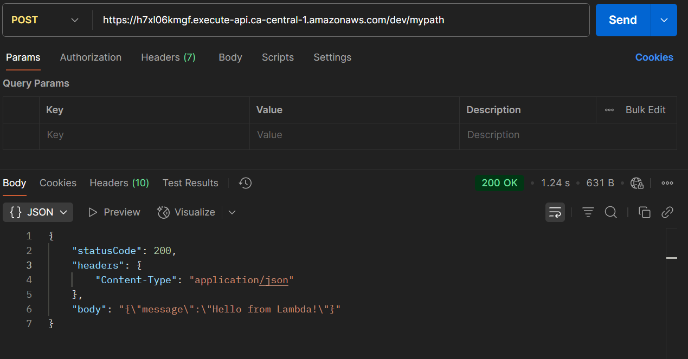

---

## AWS Cognito

### create a user pool client

- `cognito.tf`

```hcl
resource "aws_cognito_user_pool" "pool" {
  name = "mypool"
}
# create a user pool client.
resource "aws_cognito_user_pool_client" "client" {
  name                                 = "client"
  allowed_oauth_flows_user_pool_client = true
  generate_secret                      = false
  allowed_oauth_scopes                 = ["aws.cognito.signin.user.admin", "email", "openid", "profile"]
  allowed_oauth_flows                  = ["implicit", "code"]
  explicit_auth_flows                  = ["ADMIN_NO_SRP_AUTH", "USER_PASSWORD_AUTH"]
  supported_identity_providers         = ["COGNITO"]

  # associated this client with the Cognito user pool
  user_pool_id  = aws_cognito_user_pool.pool.id
  callback_urls = ["https://example.com"]
  logout_urls   = ["https://sumeet.life"]
}

# provision a test user
resource "aws_cognito_user" "example" {
  user_pool_id = aws_cognito_user_pool.pool.id
  username     = "sumeet.n"
  password     = "Test@123"
}
```

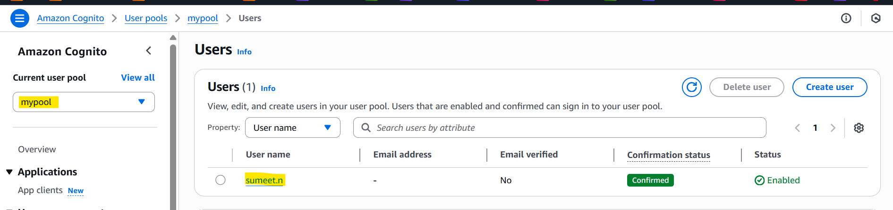

---

### Use Cognito Authorizer in API Gateway for authentication

- given a name to our authorizer, associated it with the appropriate REST API, set the type as “COGNITO_USER_POOL”, and provided the ARN of the corresponding user pool.

- `apigateway.tf`

```hcl
resource "aws_api_gateway_authorizer" "demo" {
  name = "my_apig_authorizer2"
  rest_api_id = aws_api_gateway_rest_api.my_api.id
  type = "COGNITO_USER_POOLS"
  provider_arns = [aws_cognito_user_pool.pool.arn]
}
```

- updated configuration for the API Gateway method

```hcl
resource "aws_api_gateway_method" "proxy" {
  rest_api_id = aws_api_gateway_rest_api.my_api.id
  resource_id = aws_api_gateway_resource.root.id
  http_method = "POST"

  //authorization = "NONE" // comment this out in cognito section
  authorization = "COGNITO_USER_POOLS"
  authorizer_id = aws_api_gateway_authorizer.demo.id
}
```

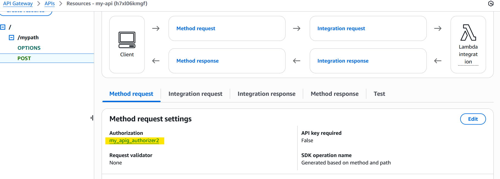

---

### Test using Postman

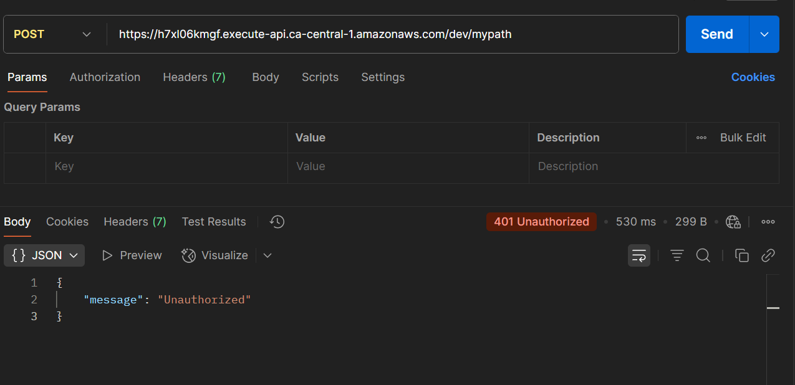

---

### Generate authentication token from Cognito and access the API

- use AWS cognito-idp CLI to generate the access token

```sh
# confirm the aws config region is correct
aws cognito-idp admin-initiate-auth --user-pool-id <USER_POOL_ID> --client-id <CLIENT_ID> --auth-flow ADMIN_NO_SRP_AUTH --auth-parameters USERNAME=sumeet.n,PASSWORD=Test@123
```

- it returns

```json
{
  "ChallengeParameters": {},
  "AuthenticationResult": {
    "AccessToken": "ACCESS_TOKEN",
    "ExpiresIn": 3600,
    "TokenType": "Bearer",
    "RefreshToken": "REFRESH_TOKEN",
    "IdToken": "ID_TOKEN"
  }
}
```

- Test IdToken with Authorizer

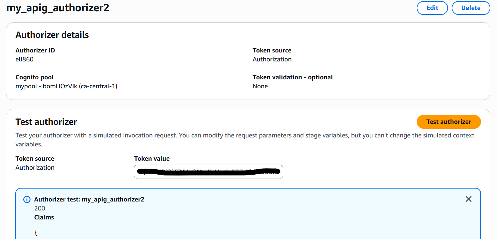

- Test IdToken with Postman
  - Authorization:`Bearer <IdToken>`

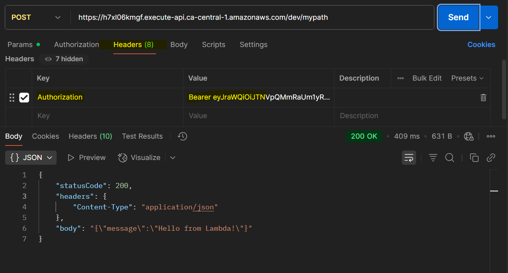
