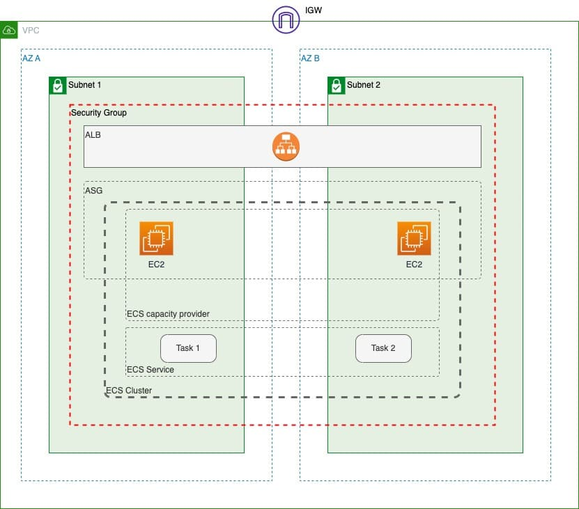

# Terraform - AWS ECS: 1st

[Back](../../README.md)

- [Terraform - AWS ECS: 1st](#terraform---aws-ecs-1st)
  - [??Overview](#overview)
  - [init](#init)
  - [Network](#network)
    - [VPC](#vpc)
    - [Subnet](#subnet)
    - [Internet Gateway (IGW)](#internet-gateway-igw)
    - [Route table](#route-table)
    - [Secure Group](#secure-group)
  - [EC2 Instance](#ec2-instance)
    - [EC2 Template](#ec2-template)
    - [Auto-Scaling Group](#auto-scaling-group)
    - [Application Load Balancer (ALB)](#application-load-balancer-alb)
  - [ECS](#ecs)
    - [ECS Cluster](#ecs-cluster)
    - [capacity providers](#capacity-providers)
    - [Create ECS task definition](#create-ecs-task-definition)
    - [Create the ECS service](#create-the-ecs-service)

---

## ??Overview



- three parts:
  - VPC: networking
    - availability zones
    - subnets
    - security groups
    - route tables
  - EC2:
    - auto-scaling groups
    - application load balancer
    - EC2 instance
  - ECS
    - cluster
    - services
    - tasks
    - capacity providers
    - image

---

## init

- Create `provider.tf`

```sh
terraform fmt
terraform init
```

---

## Network

### VPC

| Param | Value         |
| ----- | ------------- |
| Name  | main          |
| CIDR  | `10.0.0.0/16` |

```hcl
# VPC
resource "aws_vpc" "main" {
    cidr_block           = var.vpc_cidr # Refer var
    enable_dns_hostnames = true
    tags = {
        name = "main"
    }
}
```

---

### Subnet

| Name       | CIDR          | AZ              |
| ---------- | ------------- | --------------- |
| `subnet_a` | `10.0.1.0/24` | `ca-central-1a` |
| `subnet_b` | `10.0.2.0/24` | `ca-central-1b` |

```hcl
# Subnet
resource "aws_subnet" "subnet_a" {
  vpc_id                  = aws_vpc.tf_vpc.id
  cidr_block              = cidrsubnet(aws_vpc.tf_vpc.cidr_block, 8, 1)
  map_public_ip_on_launch = true
  availability_zone       = var.az_a
  tags = {
    Name     = "subnet_a",
    Resource = "subnet"
  }
}

resource "aws_subnet" "subnet_b" {
  vpc_id                  = aws_vpc.tf_vpc.id
  cidr_block              = cidrsubnet(aws_vpc.tf_vpc.cidr_block, 8, 2)
  map_public_ip_on_launch = true
  availability_zone       = var.az_b
  tags = {
    Name     = "subnet_b",
    Resource = "subnet"
  }
}
```

---

### Internet Gateway (IGW)

```hcl
# Internet Gateway
resource "aws_internet_gateway" "internet_gateway" {
    vpc_id = aws_vpc.tf_vpc.id
    tags = {
        Name = "internet_gateway",
        Resource = "Internet Gateway"
    }
}
```

---

### Route table

```hcl
# Route table
resource "aws_route_table" "route_table" {
  vpc_id = aws_vpc.tf_vpc.id
  route {
    cidr_block = "0.0.0.0/0"
    gateway_id = aws_internet_gateway.internet_gateway.id
  }
  tags = {
    Name     = "route_table",
    Resource = "Route table"
  }
}

# association, public subnet
resource "aws_route_table_association" "subnet_route" {
  subnet_id      = aws_subnet.subnet_a.id
  route_table_id = aws_route_table.route_table.id
}

resource "aws_route_table_association" "subnet2_route" {
  subnet_id      = aws_subnet.subnet_a.id
  route_table_id = aws_route_table.route_table.id
}
```

---

### Secure Group

```hcl
# Secure Group
resource "aws_security_group" "ecs_sg" {
  name   = "ecs-security-group"
  vpc_id = aws_vpc.tf_vpc.id

  ingress {
    from_port   = 0
    to_port     = 0
    protocol    = -1
    self        = "false"
    cidr_blocks = ["0.0.0.0/0"]
    description = "Accept any inbound traffic"
  }

  egress {
    from_port   = 0
    to_port     = 0
    protocol    = "-1"
    cidr_blocks = ["0.0.0.0/0"]
    description = "Accept any outbound traffic"
  }

  tags = {
    Name     = "ecs_sg",
    Resource = "Secure Group"
  }
}
```

---

## EC2 Instance

### EC2 Template

| Param                | Value                                      |
| -------------------- | ------------------------------------------ |
| Image                | `ami-0bb887e1f2559badd` Amazon Linux image |
| Type                 | `t3.micro`                                 |
| Key                  | Refer to existing key                      |
| Security group       | `ecs_sg`                                   |
| IAM instance profile | ecsInstanceRole                            |
| User data            | `ecs.sh`                                   |

---

### Auto-Scaling Group

| Param            | Value |
| ---------------- | ----- |
| Desired Capacity | 2     |
| Max size         | 3     |
| Min size         | 1     |

---

### Application Load Balancer (ALB)

---

## ECS

### ECS Cluster

### capacity providers

- associates the auto-scaling group with the cluster’s capacity provider.

---

### Create ECS task definition

---

### Create the ECS service

Name:
Cluster:
Task definition:
Desired count:
Network configuration:
Placement constraints:
Capacity provider strategy:
Load balancer:
